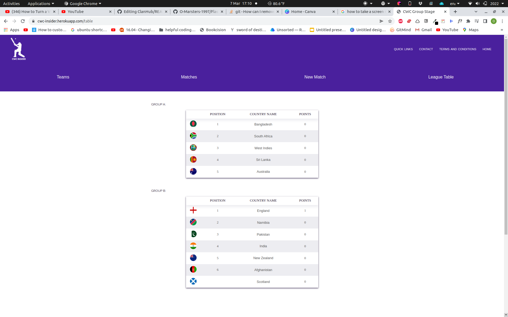

<div align="center">
  <a href="https://github.com/O-Marsters-1997/Flask_cricket_app">
  </a>
  <h1>CWC Insider</h1>

A Flask application that allows a user to stay up to date with the cricket world cup, or indeed any sporting competition that they would like to. They can add, remove and update teams, as well as games and see how teams are doing in a league table, that changes depending on how the games have gone.
<br><br><br>


[Report Issue](https://github.com/sf-adams/ClanHub/issues)
·
[CodeClan](https://codeclan.com/)
</div>

<br>

#### [The project can be found online hosted at this link](https://cwc-insider.herokuapp.com/)

## Features

- League table, that displays all teams, in order of how many points they have.
- Ability to add, edit and remove teams.
- Ability to add, remove and update matches.
- As a user changes the details for the matches that have been played, the league table updates accordingly.

## Tech Stack

- Python
- Flask
- Postgresql
- Sass (SCSS)
- Jinja

## Getting started

1. Clone this repository.

```zsh
git clone git@github.com:O-Marsters-1997/Flask_cricket_app.git
```

2. Make sure that dependencies are all installed, these being:

- Python
- Pip
- Pipenv
- Flask
- PostgreSQL

3. Install requisite dependencies

```zsh
cd <Project>
pipenv shell
```

- This will enter into a virtual environment, that will allow you to install dependencies local to project.

```zsh
pipenv install psycopg2
pipenv install psycopg2-binary
pipenv install flask-sqlalchemy
```

4. Create database in postgreSQL

```zsh
psql
# launches into psql CLI

>>> createdb cwc_insider
>>> \q
# Creates databse and exits

psql -d cwc_insider -f db/cwc_flask.sql
#Connects database with sql file in project directory
```

4. Populate database

```zsh
#make sure that you are in the root project directory
python console.py
```

5. Launch the application
```zsh
flask run
```

## Ideas for Further Development
- Authentication, so only logged in user can update the sport league's matches or games.
- The introduction of more models, so a competition can have player of the match, or player of the tournament, or an individual player's statistics can be viewable for each match.
- The ability to have multiple tournaments, so that a user can search through either existing sporting tournaments, or through a backlog of records from previous years.


